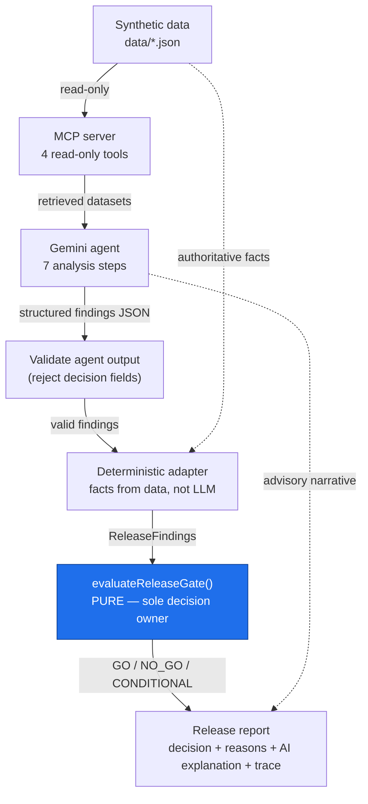
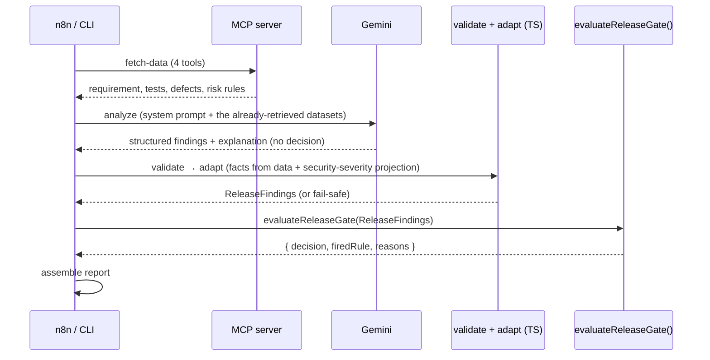
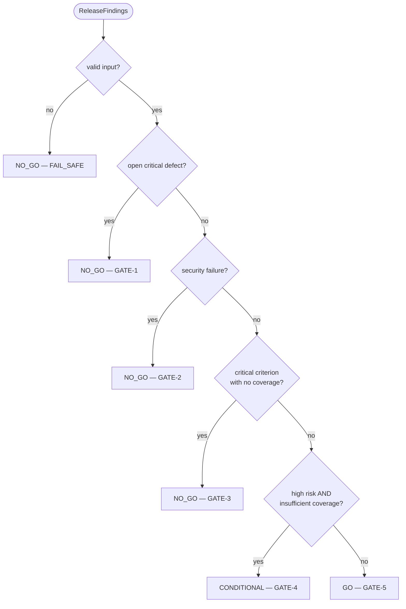

# AI QA Release Risk & Test Strategy Agent

> A small, public portfolio project exploring **AI-assisted Quality Engineering**:
> an AI agent analyses a proposed software change and produces a QA risk and
> test-strategy assessment — while a **deterministic rules layer, not the LLM,
> makes the final release decision**.

**Status:** Version 1 complete (Phases 1–7). All data is synthetic. Not a
production tool.

**The boundary that matters:** the AI analysis is **advisory**. The
`GO` / `NO_GO` / `CONDITIONAL` decision is owned solely by a pure function,
`evaluateReleaseGate()`. The language model explains the risk; it never decides,
and the pipeline rejects any model output that tries to.

---

## Project overview

This project demonstrates how a Software Quality Engineer can use an AI agent as
a QA thinking partner without handing over judgment or control.

An AI agent (Gemini 3.6 Flash) is given a proposed change. Through four read-only MCP tools
it gathers the requirement, the existing tests, the known defects, and the QA
risk rules. It performs seven analysis steps and emits **structured findings**
plus a plain-language explanation. A deterministic TypeScript gate then converts
grounded, dataset-derived facts into the release decision. An n8n workflow wires
the steps together.

Everything is built around **one completely synthetic banking change**:

> "Add a beneficiary and allow an authenticated customer to transfer money to the
> beneficiary after authentication."

No employer, client, or customer information is used anywhere.

## Problem

Release decisions in regulated domains like banking depend on QA judgment that is
often **inconsistent** (reviewers weigh risk differently), **time-pressured**
(coverage gaps and regression scope assessed quickly), and **hard to audit** (the
reasoning behind "we're okay to ship" is rarely written down in a structured
way). At the same time, teams are tempted to let an LLM "just decide" whether to
release — which is non-deterministic and not defensible.

The question this project explores: *can an AI agent accelerate QA risk analysis
while a deterministic gate keeps the actual decision safe, consistent, and
explainable?*

## Solution

| Layer | Responsibility | Where |
| --- | --- | --- |
| Synthetic data | Source of truth: requirement, tests, defects, risk rules | `data/*.json` |
| MCP server | Expose four **read-only, no-parameter** tools | `src/mcpServer.ts` |
| Gemini agent | The seven analysis steps → structured findings + explanation | `src/geminiAgent.ts`, `src/agentContract.ts` |
| Output validation | Reject malformed / incomplete output and any LLM-supplied decision | `src/agentOutputValidation.ts` |
| Deterministic adapter | Build gate input from **dataset facts** (not the LLM); grounding checks | `src/findingsAdapter.ts` |
| Deterministic gate | The `GO` / `NO_GO` / `CONDITIONAL` decision | `src/releaseGate.ts` |
| Orchestration | Run it end to end | `src/releaseAssessment.ts` (in-process), `src/pipelineCli.ts` + `workflows/` (n8n) |

### The four MCP tools

`get_requirement` · `get_existing_tests` · `get_known_defects` · `get_risk_rules`
— each returns its `data/*.json` file verbatim as a text block. Read-only, no
parameters (Version 1 has exactly one scenario).

### The seven analysis steps (the LLM)

1. Understand the change
2. Identify QA risks
3. Review existing test coverage
4. Identify missing scenarios
5. Review known defects
6. Prioritize regression testing
7. Explain the release risk

### The release gate rules (code)

Evaluated strictly in this order; the first match wins. Invalid input → `NO_GO`
(`FAIL_SAFE`).

| # | Condition | Decision |
| --- | --- | --- |
| GATE-1 | An open **critical** defect | `NO_GO` |
| GATE-2 | A **security failure** (open security defect at qualifying severity, or a `security`-area criterion with no active test) | `NO_GO` |
| GATE-3 | A **critical acceptance criterion with no active coverage** | `NO_GO` |
| GATE-4 | **High-risk change** *and* **insufficient coverage** | `CONDITIONAL` |
| GATE-5 | Otherwise | `GO` |

## Architecture



One-way flow: data → tools → AI reasoning → **code-owned decision**. The AI's
findings are an *input* to the gate; the AI never closes the loop.





## Technology stack

| Area | Choice |
| --- | --- |
| AI model | Gemini (`@google/genai`; default model `gemini-3.6-flash`, override with `GEMINI_MODEL`) |
| Tool protocol | MCP — `@modelcontextprotocol/sdk` (stdio) |
| Orchestration | n8n (workflow export; `executeCommand` nodes only) |
| Runtime | Node.js (native TypeScript execution) |
| Language | TypeScript (strict) |
| Tests | Node's built-in test runner (`node --test`) — no test framework dependency |
| Data | JSON, 100% synthetic |
| Source control | Git / GitHub |

Deliberately **not** used: databases, cloud infrastructure, real banking systems,
multiple agents, extra integrations.

## Repository layout

```
.
├── CLAUDE.md                       Project rules and scope guardrails
├── README.md                       This file
├── package.json / tsconfig.json    Node + strict TypeScript config
├── data/                           Synthetic scenario data (REQ-BEN-001)
│   ├── requirement.json            8 acceptance criteria
│   ├── existing-tests.json         11 tests + coverage map
│   ├── known-defects.json          5 defects (DEF-001..DEF-005)
│   └── risk-rules.json             risk levels + gate rule set
├── src/
│   ├── releaseGate.ts              Phase 3 — pure gate + predicates + validator
│   ├── dataLoader.ts               Phase 4 — reads data/*.json
│   ├── mcpServer.ts                Phase 4 — MCP server, 4 read-only tools
│   ├── agentContract.ts            Phase 5 — AgentFindings schema, system prompt, 7 steps
│   ├── agentOutputValidation.ts    Phase 5 — validate raw agent output
│   ├── findingsAdapter.ts          Phase 5 — agent output → ReleaseFindings (deterministic)
│   ├── releaseAssessment.ts        Phase 5 — in-process pipeline
│   ├── geminiAgent.ts              Phase 5 — live Gemini 3.6 Flash call (needs API key)
│   ├── mcpDataClient.ts            Phase 6 — fetch datasets via the MCP server
│   └── pipelineCli.ts              Phase 6 — the seam n8n drives (6 steps)
├── api/                            Local HTTP layer (Node built-ins only)
│   ├── server.ts                   static web/ + JSON/SSE endpoints (fixture + custom)
│   ├── pipelineRunner.ts           runs the existing pipelineCli.ts steps; summary via existing predicates
│   ├── scenarioData.ts             reshapes dataset facts for the browser
│   ├── policy.ts                   fixed QA risk policy generator (user supplies evidence, never policy)
│   ├── inputNormalizer.ts          untrusted payload → data/*.json-shaped datasets + coverage stats
│   ├── evidenceAnalyzer.ts         offline rules-based analyzer → grounded AgentFindings (no decision)
│   ├── customAssessmentRunner.ts   runs a user assessment through the existing pipeline
│   └── runRegistry.ts              single-use runId → payload map for the SSE prepare/stream split
├── web/                            Dependency-free workspace + report (HTML/CSS/ESM JS)
│   ├── index.html  styles.css  app.js  components.js  workspace.js  upload.js  format.js  icons.js
│   └── README.md
├── tests/                          242 tests (Node's built-in runner; .ts + .mjs) · tests/e2e/ Playwright browser test
├── workflows/
│   ├── release-risk-assessment.n8n.json   Phase 6 — importable workflow
│   ├── sample-agent-findings.json          synthetic recorded output for offline runs
│   └── README.md
├── examples/
│   ├── release-report.REQ-BEN-001.json    captured end-to-end output
│   └── README.md
└── docs/architecture.md            As-built architecture + diagrams
```

## Running it

**Prerequisites:** Node.js with native TypeScript execution — Node 24 is what this
was built and tested on; Node ≥ 23.6 runs `.ts` files without a flag. Then:

```bash
npm install          # runtime: @google/genai, @modelcontextprotocol/sdk, zod · dev: typescript, @types/node, @playwright/test
npm test             # 242 offline, deterministic tests (Node's built-in runner)
npm run check        # typecheck (tsc --noEmit) + tests
npm run build        # optional: emit dist/ (nothing consumes it; dist/ is git-ignored)
npm run test:e2e     # Playwright browser test of the full workspace flow (needs: npx playwright install chromium)
```

**Run the assessment workspace** (browser UI — no runtime dependencies):

```bash
npm run demo         # then open http://localhost:8080
```

The server listens on **both loopback families** (`127.0.0.1` and `::1`) so the
workspace loads whether the browser resolves `localhost` to IPv4 or IPv6 (the
latter is the Windows default). Set `HOST` to pin a single interface, `PORT` to
change the port.

A restrained, professional workspace where a QA or product user provides the
**release context** (scope, user story, criticality), **acceptance criteria**,
optional **business rules**, and **QA evidence** (existing test cases, known
defects, supporting documents), then clicks **Analyze Release Risk**. The backend
normalises that input into the same `data/*.json`-shaped datasets the pipeline
already consumes, runs the real six-stage pipeline, and returns a release-risk
report: executive cards, the deterministic release decision, a non-technical
readiness summary, AI QA analysis (advisory), coverage, missing scenarios,
defects, regression priorities, the decision trace, and a collapsed Technical
Details panel.

Custom assessments call **Gemini 3.6 Flash** when `GEMINI_API_KEY` is set,
sending it the same normalized datasets the fixture flow would send — no
document parsing, no browsing, just the evidence you typed or uploaded as
rows. If the key is unset, or a Gemini call fails to produce valid, gate-ready
findings, the app **safely falls back** to an offline rules-based analyzer
(`api/evidenceAnalyzer.ts`) that restates and explains the submitted evidence —
it invents nothing and makes no decision. Technical Details honestly reports
which one actually ran: `AI analysis: Gemini 3.6 Flash` or `QA analysis mode:
Rules based`. The `REQ-BEN-001` scenario remains available under the header
**Demo / Regression fixture** menu, with the same Gemini-or-rules-based
behavior. `evaluateReleaseGate()` is still the sole owner of the decision.
See [`web/`](web/) and [`api/`](api/).

### Product boundary

The workspace **analyses the evidence you supply**. It does not:

- execute or deploy your application, or run it in any environment;
- replace automated testing — it reasons about test *results you provide*, it
  does not create or run tests;
- crawl or browse URLs, and it does not run Playwright, Postman, or any other
  tool;
- access production, staging, CI, or any live system or data;
- independently verify whether a defect, a passing test, or a coverage claim is
  real — missing or unverifiable evidence is reported as a finding, never
  invented around.

The deterministic gate makes the release decision from the grounded facts; the AI
layer explains risk and never decides.

**Run the MCP server** (stdio):

```bash
npm run mcp
```

**Run the full assessment with a live Gemini call** (needs `GEMINI_API_KEY`):

```bash
npm run agent
```

**Run the pipeline offline** (no API key — uses a synthetic recorded model
output):

```bash
PIPELINE_AGENT_FINDINGS_FILE=./workflows/sample-agent-findings.json \
  node src/pipelineCli.ts run --state ./.pipeline-run/state.json
```

**The n8n workflow:** import `workflows/release-risk-assessment.n8n.json`
(n8n → Workflows → Import from File). Run n8n with the repository root as its
working directory. See `workflows/README.md`. The workflow stores no credentials.

See [`examples/`](examples/) for a captured run: `REQ-BEN-001` → `NO_GO` /
`GATE-2` (open security defect `DEF-004` + uncovered security criterion `AC-8`).

## Phases delivered (Version 1)

| Phase | Focus | Delivered |
| --- | --- | --- |
| 1 | Foundation — repo scaffold and docs | `CLAUDE.md`, `README.md`, `package.json`, `src/`, `data/`, `tests/`, `docs/` |
| 2 | Synthetic dataset | `data/*.json` for the one scenario |
| 3 | Deterministic release gate | `src/releaseGate.ts` + 43 unit tests |
| 4 | MCP server | `src/mcpServer.ts` + `src/dataLoader.ts`, 4 tools + 22 tests |
| 5 | Gemini reasoning layer | contract, validation, adapter, orchestrator, live agent + 66 tests |
| 6 | n8n workflow | `workflows/` + `src/pipelineCli.ts` + `src/mcpDataClient.ts` + 29 tests |
| 7 | Polish & write-up | this README, `docs/architecture.md`, diagrams, `examples/`, refreshed sub-READMEs |

## Definition of Done — Version 1

- [x] The single synthetic scenario exists as JSON data — no real or proprietary
      information anywhere in the repo.
- [x] The MCP server exposes exactly the four tools, read-only, no parameters.
- [x] The LLM (Gemini 3.6 Flash), using only those tools' retrieved data, produces a structured QA assessment covering
      change understanding, risks, coverage review, missing scenarios, defect
      review, regression priorities, and a release-risk explanation.
- [x] The deterministic gate is a pure function returning `GO` / `NO_GO` /
      `CONDITIONAL` strictly from the five documented rules, in fixed precedence.
- [x] The LLM never emits the final decision; the gate always does, and the
      pipeline rejects any model output containing a decision field.
- [x] An n8n workflow runs the whole flow end to end.
- [x] Tests exist for the deterministic gate (and every other layer) and pass
      (160 tests).
- [x] `README.md` and `docs/` explain the design, the boundaries, and the
      limitations honestly — no production-readiness claims, no invented metrics.
- [x] The code stays small and readable; a new reader can follow it in one sitting.

## Limitations & non-goals

- **One hard-coded scenario.** The design is not exercised against variety.
  Generalising to many changes is out of scope for Version 1.
- **Deliberately coarse rules.** Five gate rules; a handful of risk predicates.
  Real release governance is far richer — the point here is the *pattern* of a
  code-owned decision with an AI advisory layer, not rule coverage.
- **Synthetic data only.** `data/*.json` and `workflows/sample-agent-findings.json`
  are illustrative and hand-written. Any numbers (e.g. a per-transaction limit,
  a coverage-ratio threshold) are labelled synthetic/illustrative and are not
  benchmarks or claims.
- **No real analysis in the committed example.** `examples/` was generated in
  offline mode from the recorded synthetic output, not a live model run.
- **Not production-ready.** No persistence, no auth, no error budget, no
  observability, no packaging. Each run is standalone.
- **The AI step is non-deterministic** and not covered by automated tests; the
  deterministic core (validation → adapter → gate) is, and its fail-safe
  behaviour is what stops a weak or adversarial analysis from producing an
  unsafe `GO`.
- **Not affiliated** with any employer or client.

## Disclaimer

Personal learning and portfolio project. Uses only synthetic data, models no real
system, and makes no claim of production readiness.
