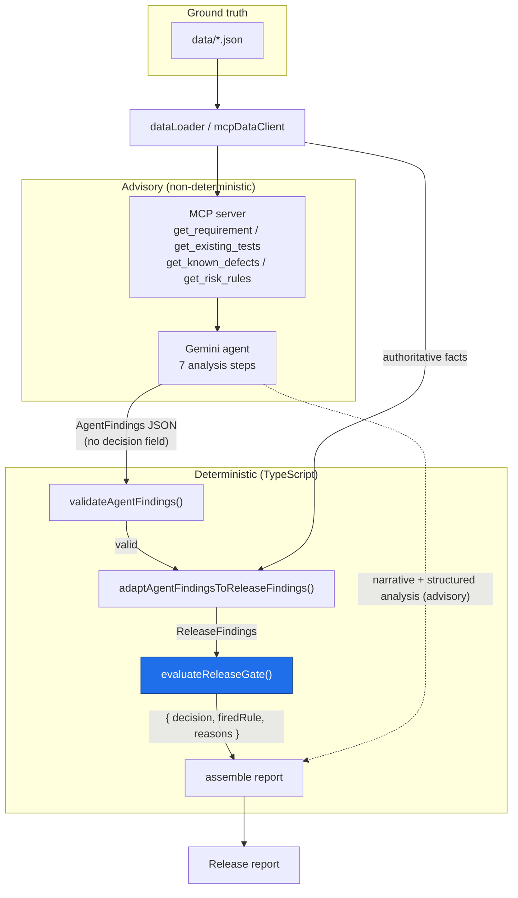
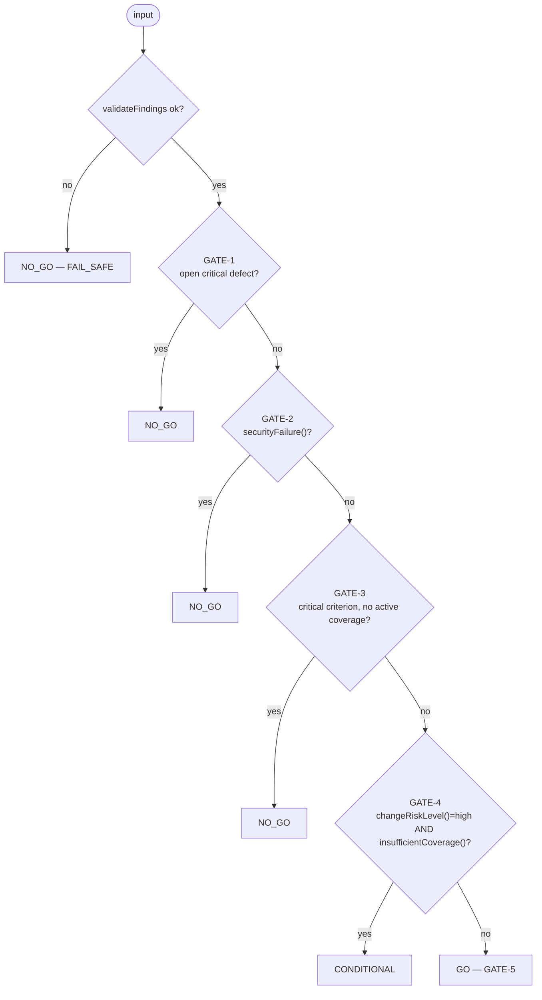
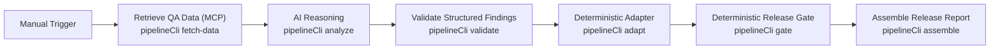

# Architecture & Design — AI QA Release Risk & Test Strategy Agent

**Version:** 1 — **as built**. This document was verified against the
implementation in `src/`, `data/`, `workflows/`, and `tests/`.

---

## 1. Purpose

A small system in which an AI agent accelerates QA risk analysis for a proposed
software change, while a deterministic rules layer — not the LLM — owns the final
release decision.

Minimal by design: one agent, four read-only tools, one deterministic gate, one
orchestration workflow, one synthetic scenario.

## 2. Design goals and non-goals

### Goals

- **Separation of concerns.** The AI reasons and explains; code decides.
- **Determinism where it matters.** The same `ReleaseFindings` always yields the
  same decision — no I/O, no randomness, no time dependence in the gate.
- **Auditability.** The decision, the rule that fired, and the reasons are
  emitted as structured output alongside the AI narrative and a step trace.
- **Grounding.** Gate inputs are built from dataset facts, not from LLM claims;
  the agent's echoed provenance is cross-checked.
- **Readability.** A new reader can follow the whole flow in one sitting.
- **Safety by construction.** MCP tools are read-only; every failure path fails
  safe to `NO_GO`.

### Non-goals (Version 1)

- Not a general-purpose release tool — exactly one synthetic scenario.
- No databases, cloud infrastructure, real integrations, or production packaging.
- No multi-agent orchestration.
- No production-readiness claims, no invented metrics.
- No learning/feedback loop; gate rules are fixed and hand-written.

## 3. The synthetic scenario

All components operate on one completely synthetic banking change (`REQ-BEN-001`):

> "Add a beneficiary and allow an authenticated customer to transfer money to the
> beneficiary after authentication."

It exercises QA-interesting areas: authentication (incl. step-up), authorization
(ownership), data creation (the beneficiary), money movement (the transfer),
input validation, and sensitive-data handling.

## 4. Component overview

| Component | Module(s) | Responsibility |
| --- | --- | --- |
| Synthetic data | `data/*.json` | Source of truth: requirement (8 criteria), 11 tests + coverage map, 5 defects, risk rules |
| Data loader | `src/dataLoader.ts` | Read and parse `data/*.json` (the one side effect) |
| MCP server | `src/mcpServer.ts` | Expose four read-only, no-parameter tools over stdio |
| MCP data client | `src/mcpDataClient.ts` | Retrieve the four datasets by calling the MCP tools |
| Agent contract | `src/agentContract.ts` | `AgentFindings` schema, system prompt, the 7 steps, forbidden keys |
| Live Gemini agent | `src/geminiAgent.ts` | Send the already-retrieved datasets to Gemini 3.6 Flash in one turn; return raw findings |
| Output validation | `src/agentOutputValidation.ts` | Structurally validate raw agent output; reject decision fields |
| Deterministic adapter | `src/findingsAdapter.ts` | Build `ReleaseFindings` from dataset facts; grounding checks; severity projection |
| Deterministic gate | `src/releaseGate.ts` | `evaluateReleaseGate()` — the sole decision owner |
| In-process pipeline | `src/releaseAssessment.ts` | `runReleaseAssessment()` — load → analyze → validate → adapt → gate → assemble |
| n8n seam | `src/pipelineCli.ts` | The same six steps as separate CLI subcommands, driven by the workflow |
| Workflow | `workflows/release-risk-assessment.n8n.json` | Manual Trigger + 6 `executeCommand` nodes, linear |

## 5. Data flow



The flow is one-way. The agent's output is an **input** to the gate; the agent
never receives authority to emit the decision.

## 6. MCP tools

Server name `ai-qa-release-risk-agent` (v0.1.0), stdio transport. All four tools
are **read-only** and take **no parameters** (Version 1 has one scenario). Each
returns the corresponding `data/*.json` file **verbatim** as a single text
content block.

| Tool | File | Contents |
| --- | --- | --- |
| `get_requirement` | `data/requirement.json` | `requirementId`, title, description, `criticality`, `affectedAreas`, `acceptanceCriteria[]` (`id`, `area`, `critical`, `text`) |
| `get_existing_tests` | `data/existing-tests.json` | `tests[]` (`testId`, `area`, `testType`, `coverageType`, `status`, `covers[]`) + `coverageByAcceptanceCriterion[]` |
| `get_known_defects` | `data/known-defects.json` | `defects[]` (`defectId`, `severity`, `status`, `area`, `security`, `description`) |
| `get_risk_rules` | `data/risk-rules.json` | `riskLevelsByArea`, `criticalAcceptanceCriteriaRule`, `insufficientCoverageRule` (COV-1/2/3), `securityFailureRule` (SEC-1/2), `releaseGateRules` (GATE-1..5) |

## 7. Gemini agent — responsibilities and output

Seven analysis steps, in order: (1) understand the change, (2) identify QA risks,
(3) review existing coverage, (4) identify missing scenarios, (5) review known
defects, (6) prioritize regression testing, (7) explain the release risk.

The agent returns one JSON object (`AgentFindings`) — **no decision field**:

```jsonc
{
  "schemaVersion": 1,
  "changeSummary": "string",                                  // step 1
  "identifiedRisks": [                                        // step 2
    { "area": "string", "description": "string", "severity": "critical|high|medium|low" }
  ],
  "coverageAssessment": [                                     // step 3
    { "acceptanceCriterionId": "string", "covered": true, "notes": "string" }
  ],
  "missingScenarios": ["string"],                             // step 4
  "defectReview": [                                           // step 5
    { "defectId": "string", "stillRelevant": true, "notes": "string" }
  ],
  "regressionPriorities": [                                   // step 6
    { "area": "string", "priority": "high|medium|low", "rationale": "string" }
  ],
  "releaseRiskExplanation": "string",                         // step 7 — human-readable
  "dataProvenance": {                                         // grounding echo
    "requirementId": "string",
    "acceptanceCriteriaCount": 0,
    "existingTestCount": 0,
    "knownDefectCount": 0,
    "riskRulesScenario": "string"
  }
}
```

`validateAgentFindings()` runs first. It rejects non-objects, wrong types,
missing keys, and any of seven **forbidden top-level keys** (`decision`,
`releaseDecision`, `gateDecision`, `goNoGo`, `go_no_go`, `verdict`,
`recommendation`). It never fills defaults; a problem fails the pipeline safe.

## 8. Deterministic adapter (Phase 5)

`adaptAgentFindingsToReleaseFindings(agentFindings, datasets)` →
`{ ok: true, releaseFindings } | { ok: false, problems }`. Pure and deterministic.

- **Facts from data, not the LLM.** `affectedAreas`, `acceptanceCriteria`,
  `defects`, `tests`, and the risk-rule config are read from the datasets. The
  agent's `coverageAssessment` / `defectReview` / risk opinions are advisory and
  never feed the gate.
- **`securityFailureSeverities` projection.** `projectSecurityFailureSeverities()`
  reads `risk-rules.json` → `securityFailureRule.conditions` → the `SEC-1`
  condition text and returns the severities it names, in canonical order — for
  the shipped data, `["critical", "high"]`. It throws if `SEC-1` is absent or
  names no severities (surfaced, not guessed).
- **Grounding checks (fail safe on mismatch).** `dataProvenance` counts and
  `requirementId` / `riskRulesScenario` must match the datasets; every
  `coverageAssessment[].acceptanceCriterionId` and `defectReview[].defectId` must
  exist.
- **Final guard.** The assembled object is run through the Phase 3
  `validateFindings()` before it can reach the gate.

## 9. Deterministic release gate (Phase 3)

`evaluateReleaseGate(input: unknown): { decision, firedRule, reasons }`.

`decision` ∈ `GO | NO_GO | CONDITIONAL`. `firedRule` ∈
`GATE-1 | GATE-2 | GATE-3 | GATE-4 | GATE-5 | FAIL_SAFE`.

**Precedence (`EVALUATION_ORDER`) — first match wins:**



**Helper predicates** (all pure, all exported and unit-tested):

- `changeRiskLevel(findings)` — highest inherent risk among affected areas.
  Always derived; **no caller override**, so bad input cannot lower the risk.
- `criticalAcceptanceCriteria(findings)` — criteria flagged `critical` or in a
  `criticalAreas` area.
- `insufficientCoverage(findings)` — true on any of COV-1 (critical criterion,
  zero active tests), COV-2 (high-risk area, no active negative test), COV-3
  (active-criterion coverage ratio below the illustrative `0.8` threshold).
- `securityFailure(findings)` — true on SEC-1 (open `security: true` defect at a
  qualifying severity) or SEC-2 (a `security`-area criterion with zero active
  tests).

**Properties:** pure, total (always one of three decisions), explainable
(`firedRule` + `reasons`), independently tested (43 tests pinning each rule and
the precedence). Invalid or missing input → `NO_GO` / `FAIL_SAFE`; the gate never
guesses.

The LLM cannot override or bypass this function: its output is validated, the
gate's inputs are dataset-derived, and the decision is only ever read from the
gate's return value.

## 10. Orchestration

Two equivalent drivers over the same components:

- **In-process:** `runReleaseAssessment({ analyze, loadDataset? })` →
  `ReleaseAssessment` (`src/releaseAssessment.ts`). `analyze` is injected so the
  pipeline is testable without a live model.
- **n8n seam:** `src/pipelineCli.ts` exposes the six steps as CLI subcommands
  passing a JSON state file: `fetch-data → analyze → validate → adapt → gate →
  assemble`. Plumbing only — every step delegates to a Phase 2–5 component; no QA
  or decision logic lives here.



The n8n workflow (`workflows/release-risk-assessment.n8n.json`) is exactly this
chain of `executeCommand` nodes. It stores **no credentials, keys, URLs, or real
data**. The `analyze` step calls Gemini 3.6 Flash when `GEMINI_API_KEY` is set, or reads
a synthetic recorded output when `PIPELINE_AGENT_FINDINGS_FILE` points at
`workflows/sample-agent-findings.json`.

Every failure path (data load, model error, invalid output, adapter mismatch)
records a trace entry and lets the gate step fail safe: it is handed
deliberately-invalid input and returns `NO_GO` / `FAIL_SAFE`.

## 11. The assembled report

`assemble` copies fields — no logic:

| Field | Source |
| --- | --- |
| `releaseDecision`, `firedRule`, `reasons` | `evaluateReleaseGate()` verbatim |
| `decisionAuthority` | fixed string naming the gate as the decider |
| `aiQaExplanation`, `changeSummary`, `identifiedRisks`, `coverageAssessment`, `missingScenarios`, `defectReview`, `regressionPriorities`, `dataProvenance` | the validated `AgentFindings` (advisory) |
| `agentOutputValid`, `adapterOk` | pipeline step outcomes |
| `pipelineTrace` | ordered `{ step, ok, detail }` entries |

See `examples/release-report.REQ-BEN-001.json` for a captured run:
`NO_GO` / `GATE-2` (open security defect `DEF-004`; uncovered security criterion
`AC-8`).

## 11a. Demo dashboard (`api/`, `web/`) — presentation layer

A minimal local HTTP server (`api/server.ts`, Node built‑ins only — no framework,
no new dependencies) serves a dependency‑free browser dashboard (`web/`) and a
small JSON/SSE API. It is a **presentation and interaction layer only**:

- `POST /api/assess` and `GET /api/assess/stream` run the **existing** six
  `src/pipelineCli.ts` steps as child processes (the same seam n8n uses) and
  return the resulting `ReleaseReport`. The SSE variant emits one event per real
  stage so the UI shows genuine progress.
- The executive‑summary values (Change Risk / Test Coverage / Security Risk) are
  produced by calling the **existing exported predicates** `changeRiskLevel()`,
  `insufficientCoverage()`, `securityFailure()` on the adapter's `releaseFindings`
  — reuse, not duplication. They are `null` when the adapter did not succeed.
- The decision shown is always `report.releaseDecision` from
  `evaluateReleaseGate()`; the UI renders `UNAVAILABLE` (never `GO`) if it is
  missing. Every backend failure path still returns `NO_GO` / `FAIL_SAFE`.
- Without `GEMINI_API_KEY` — or if a live Gemini call fails to produce valid,
  gate-ready findings — the `analyze` step falls back to the recorded synthetic
  output (`workflows/sample-agent-findings.json`); the dashboard shows an honest
  "AI mode" badge either way, never a false "live AI" claim.

No decision, risk, coverage, security, or gate logic lives in `api/` or `web/`.
Run with `npm run demo` → `http://localhost:8080`. The server binds **both
loopback address families** (`127.0.0.1` and `::1`): Windows resolves `localhost`
to `::1` first, so a 127.0.0.1‑only bind let the page load but made the browser's
`fetch()` calls fail with "Failed to fetch". `HOST` pins a single interface.

A Playwright browser test (`tests/e2e/assessment.spec.ts`, `npm run test:e2e`)
drives the full workspace flow — sample data + PDF upload + submit + report — in
headless Chromium and asserts the rendered release decision matches a direct API
call. `@playwright/test` is a dev‑only dependency; `npm run check` stays
browser‑free.

## 11b. Reusable assessment workspace (`api/`, `web/`) — user-supplied evidence

The same server also accepts a **user-submitted** assessment. The browser
workspace collects release context, acceptance criteria, optional business rules,
and QA evidence (test cases, defects, supporting documents); the backend turns
that untrusted payload into the four `data/*.json`-shaped datasets the pipeline
already consumes and runs the **unchanged** six steps.

- `api/policy.ts` builds the QA risk policy artifact from code — the user supplies
  evidence, never policy, and never anything that could alter a gate rule or a
  pipeline command.
- `api/inputNormalizer.ts` type-checks, length-caps, and enum-constrains every
  field; generates the `requirementId` server-side as `REQ-USR-<hash>` (never
  `REQ-BEN-001`); derives coverage numbers from test↔criterion links (never taken
  from input); sanitises document filenames to a basename; and returns
  `{ ok:false, missing, problems }` (HTTP 422, no run) when required context is
  absent.
- `api/evidenceAnalyzer.ts` is an **offline, rules-based** `AnalyzeFn`: it
  restates and explains the submitted evidence into a `validateAgentFindings`-valid
  `AgentFindings` with exact provenance, makes no decision, and invents nothing.
  It is always computed up front, whether or not it ends up being used, so the
  fallback below is instant.
- When `GEMINI_API_KEY` is set, `api/customAssessmentRunner.ts` instead lets the
  `analyze` step call Gemini 3.6 Flash directly with the same normalized
  datasets. If that call — or the `validate`/`adapt` steps that follow it — fails
  to produce valid, gate-ready findings, the runner silently redoes just that
  small batch of steps against the rules-based findings from
  `evidenceAnalyzer.ts` instead, before reporting any stage to the UI. The report
  is always labelled honestly (`Execution mode: AI analysis: Gemini 3.6 Flash` or
  `QA analysis mode: Rules based`) — never a false "live AI" claim.
- `api/customAssessmentRunner.ts` writes a pre-populated pipeline state plus the
  rules-based findings file, runs `analyze → validate → adapt → gate → assemble`
  as child processes, streams one SSE event per real stage, and deletes both temp
  files in a `finally`.
- `POST /api/assess/custom` validates then returns a single-use `runId`;
  `GET /api/assess/custom/stream?runId=` streams the stages and the result. A
  `?blocking=1` variant returns the full result directly.

**Boundary.** The workspace analyses supplied evidence only. It does not execute
or deploy the application, replace automated testing, crawl URLs, run Playwright
or Postman, access any live system, or independently verify whether a defect or a
passing test is real — missing evidence is a finding, not a licence to invent.
`evaluateReleaseGate()` remains the sole owner of `report.releaseDecision`; every
failure path still returns `NO_GO` / `FAIL_SAFE`.

## 12. Safety, privacy, and public-repo constraints

- **Synthetic data only.** No employer, client, or customer information anywhere.
- **No secrets.** No credentials, tokens, internal URLs, or proprietary content
  in code, config, data, the workflow export, or the example output. Tests
  enforce this on the workflow JSON.
- **Read-only tools.** The MCP server cannot mutate anything.
- **No invented metrics.** Illustrative values (transaction limit, coverage
  threshold) are labelled synthetic.
- **No production-readiness claim.**

## 13. Trade-offs and known limitations

- One hard-coded scenario — the design is not exercised against variety.
- Five coarse gate rules — the point is the *pattern* of a code-owned decision,
  not governance completeness.
- The AI step is non-deterministic and not covered by automated tests; the
  deterministic core is, and its fail-safe behaviour prevents a weak or
  adversarial analysis from producing an unsafe `GO`.
- No persistence — each run is standalone.
- n8n integration is via `executeCommand` shelling to `node src/pipelineCli.ts`
  (n8n cannot import the project's ESM/TS modules directly); it must run with the
  repository root as its working directory.

## 14. Phase history (all delivered — Version 1)

| Phase | Delivered |
| --- | --- |
| 1 | Foundation: scaffold + docs |
| 2 | Synthetic dataset (`data/*.json`) |
| 3 | Deterministic gate + 43 tests |
| 4 | MCP server + data loader + 22 tests |
| 5 | Gemini reasoning layer (contract, validation, adapter, orchestrator, live agent) + 66 tests |
| 6 | n8n workflow + pipeline CLI + MCP data client + 29 tests |
| 7 | Polish: README, this document, Mermaid diagrams, `examples/`, refreshed sub-READMEs |

| 8 | Reusable assessment workspace: `api/policy.ts`, `api/inputNormalizer.ts`, `api/evidenceAnalyzer.ts`, `api/customAssessmentRunner.ts`, `api/runRegistry.ts`, rebuilt `web/` workspace + report; dual‑stack loopback bind; Playwright browser regression + 60 tests |

Total: **232 tests** in the Node runner (all offline and deterministic) plus one
Playwright browser test (`npm run test:e2e`). The `api/` + `web/` layer is
presentation and input-normalisation only; it changes no existing backend logic
and does not touch `src/**`, `data/**`, or the gate.
